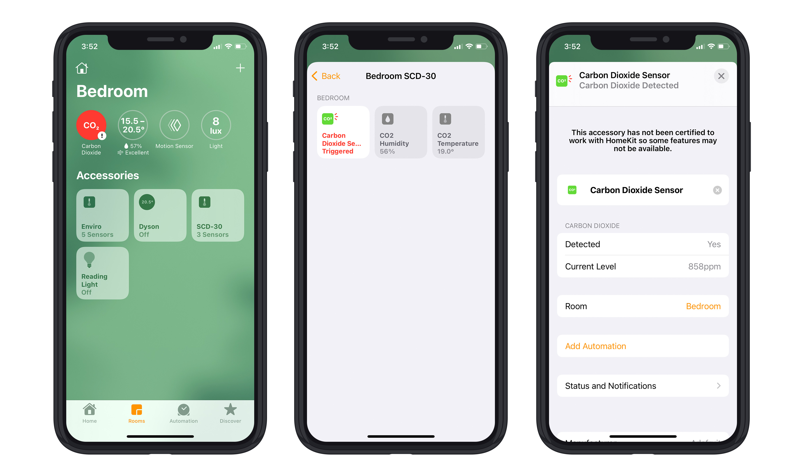

# HomeKit SCD30 Sensor
An Apple HomeKit accessory using Sensirion SCD30 Sensor.

## Hardware
* [Sensirion SCD30 Sensor](https://sensirion.com/products/catalog/SCD30/)
* [LattePanda Alpha 864s](https://www.lattepanda.com/lattepanda-alpha)

### Wiring
Adafruit have a great tutorial: [Learn SCD30](https://learn.adafruit.com/adafruit-scd30/python-circuitpython)

[LattePanda Alpha pin](http://docs.lattepanda.com/content/alpha_edition/io_playability/) | [SCD30 Sensor pin](https://sensirion.com/media/documents/4EAF6AF8/61652C3C/Sensirion_CO2_Sensors_SCD30_Datasheet.pdf)
---|---
I²S `3.3V` | `VDD` Supply Voltage
I²C `GND` | `GND` Ground
I²C `SCL` | `TX/SCL` I²C SCL
I²C `SDA` | `RX/SDA` I²C SDA

## Software
* Install [Go](http://golang.org/doc/install) >= 1.19
* Build: `go build main.go`
* Run: `go run main.go`
* In iOS Home app, click Add Accessory -> "More options..." and you should see "SCD-30", use the pin code `00102003`.
